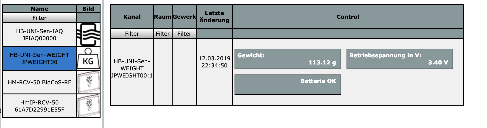
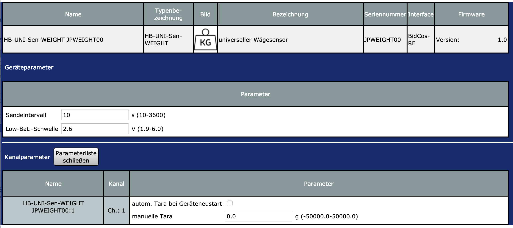

# HB-UNI-Sen-WEIGHT

- Wägesensor [HX711 mit 1kg Load Cell](https://de.aliexpress.com/item/W-gezelle-1-KG-5-KG-10-KG-20-KG-HX711-AD-Modul-Gewicht-Sensor-Elektronische/32958628401.html) (bis 50kg möglich)

#### Verdrahtung

