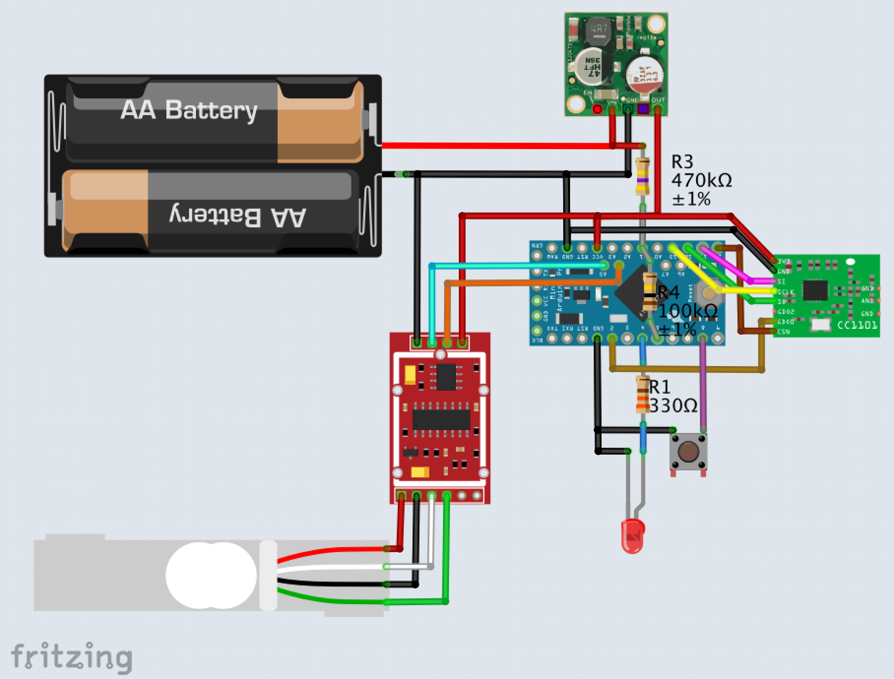

# HB-UNI-Sen-WEIGHT

#### Bauteile
- [Arduino Pro Mini **3.3V / 8MHz**](https://de.aliexpress.com/item/Free-Shipping-1pcs-pro-mini-atmega328-Pro-Mini-328-Mini-ATMEGA328-3-3V-8MHz-for-Arduino/32340942669.html)
- [CC1101 Funkmodul](https://de.aliexpress.com/item/CC1101-Drahtlose-Modul-Fern-bertragung-Antenne-868-mhz-SPI-Interface-Low-Power-M115-F-r-FSK/32924239954.html)
- Wägesensor [HX711 mit 1kg Load Cell](https://de.aliexpress.com/item/W-gezelle-1-KG-5-KG-10-KG-20-KG-HX711-AD-Modul-Gewicht-Sensor-Elektronische/32958628401.html) (bis 50kg möglich)
- LED, Taster, Widerstände (100k, 470k, 330)
- [3.3V StepUp Converter](https://www.ebay.de/itm/382058974507)


#### Verdrahtung



#### Kalibrierung
- [Kalibrierungssketch](https://raw.githubusercontent.com/jp112sdl/HB-UNI-Sen-WEIGHT/master/Calibration/Calibration.ino) flashen
- Anweisungen im [seriellen Monitor](https://asksinpp.de/Grundlagen/FAQ/Debugging.html#serieller-monitor) (57600 Baud!) folgen
  - es wird ein bekanntes Gewicht benötigt. z.B. ein Glas Wasser mit der Küchenwaage wiegen und Gewicht notieren
  - bei der Eingabe des Gewichts im seriellen Monitor ist das Dezimalkomma (,) durch einen Punkt (.) zu ersetzen
    - 234,4 Gramm -> Eingabe: 234.4
- am Ende werden 2 Kalibrierwerte ausgegeben, z.B.
```
#define HX711_CALIBRATION 873.58f
#define HX711_OFFSET     -43556L
```
- die Werte in den [HB-UNI-Sen-WEIGHT.ino](https://raw.githubusercontent.com/jp112sdl/HB-UNI-Sen-WEIGHT/master/HB-UNI-Sen-WEIGHT.ino) Sketch eintragen (Zeilen 30 und 31)

#### CCU


#### Zubehör

Eine passende Wägefläche gibts bei [Thingiverse](https://www.thingiverse.com/thing:3129439):

